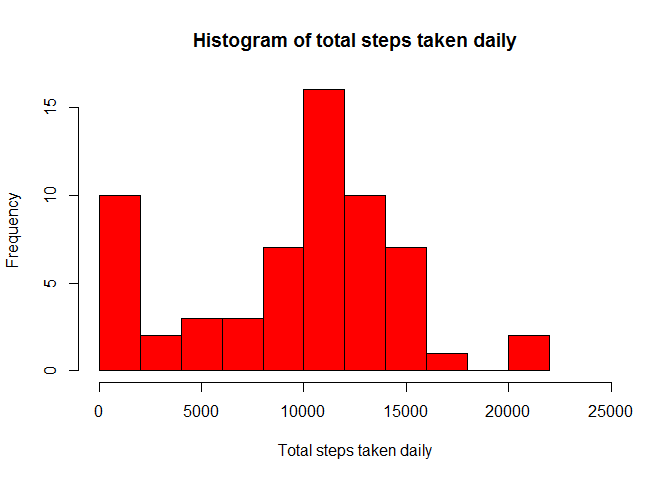
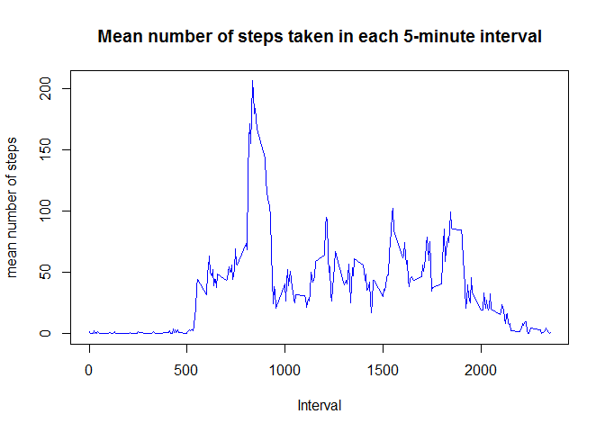
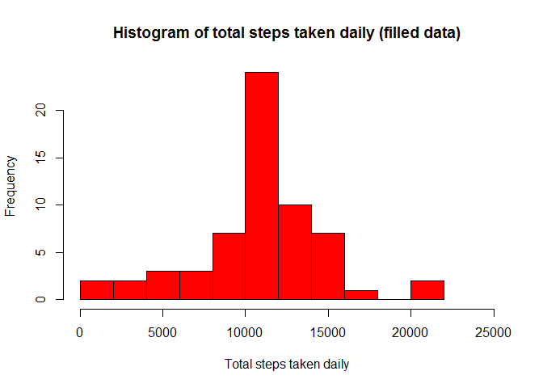

# Reproducible Research: Peer Assessment 1
Jonathan Williams  
16-01-2016  


This document outlines the process of a reproducible data analysis. The data comes from a data set, `activity.csv`, which contains data for the number of steps taken by an individual in 5-minute windows, over the course of 2 weeks. This has been completed for the Coursera Course on Reproducible Research. Before loading and processing the data all necessary packages are loaded (and installed if not present)


```r
if(!require("lubridate")){
        install.packages("lubridate")
}
library(lubridate)
#
if(!require("dplyr")){
        install.packages("dplyr")
}
library(dplyr)
#
if(!require("lattice")){
        install.packages("lattice")
}
library(lattice)
```


## Loading and preprocessing the data


First the data is read in to R, and stored in the variable `data`. (Note: this requires the woking directory to be set to that containing the data)


```r
data <- read.csv("activity.csv", stringsAsFactors = FALSE, na.strings = "NA")
```


Next the date variable is re-formatted so as to be a date object in R.


```r
data[,2] <- lubridate::ymd(data[,2])
```


## What is mean total number of steps taken per day?


Now the total number of steps taken on each data is calculated. As there are missing values in the data set these are ignored in counting the data points. Hence, in this case, days where all data is missing will be counted as having no steps taken.


```r
total.steps <- data %>%
        dplyr::group_by(date) %>%
        dplyr::summarise(total_steps = sum(steps, na.rm = TRUE))
```


These daily totals can then be visualised with the help of a histogram as plotted below (note the spike of days with 0 steps, an artefact of the missing values)


```r
hist(total.steps$total_steps, col = "red", breaks = 10, 
     xlab = "Total steps taken daily", xlim = c(0,25000),
     main = "Histogram of total steps taken daily")
```

\


To further analyse the daily step counts, the mean and median values are computed below (again, the days with missing data will cause these values to be biased underestimates)


```r
averages <- c(
                mean(total.steps$total_steps, na.rm = TRUE), 
              median(total.steps$total_steps, na.rm = TRUE)
              )
names(averages) <- c("mean","median")
print(averages)
```

```
##     mean   median 
##  9354.23 10395.00
```


Here we can note that the median is high compared to the mean (as the mean is more affected by the zeroes resulting from missing values)


## What is the average daily activity pattern?


To further understand the data, the daily pattern of steps is considered. This is is achieved by calculating the average number of steps taken in each 5-minute interval across all days. This is calculated by the code below. Here the missing values don't bias the means calculated as they are ignored by the argument `na.rm = TRUE` passed to the function `mean`


```r
time.average <- data %>%
        dplyr::group_by(interval) %>%
        dplyr::summarise(mean = mean(steps, na.rm = TRUE))
```


To visualise this information a time series is plotted below.


```r
title <- "Mean number of steps taken in each 5-minute interval"
with(time.average,plot(interval, mean, type = "l", col ="blue",
                       xlab = "Interval", 
                       ylab = "mean number of steps",
                       main = title))
```

\


It is then interesting to note the large spike at around interval 800. To investigate exactly when this peak is the code below is used.


```r
max.int <- time.average$interval[which.max(time.average$mean)]
names(max.int) <- "maximum_interval"
print(max.int)
```

```
## maximum_interval 
##              835
```


This turns out to be interval 835, hardly surpising as this is likely to do with travelling to work at the time of 8:35.


## Imputing missing values


Given the missing values noted earlier, it might be interesting to see what their effect is. To this end, the missing values can be imputed and a similar analysis applied to the resulting data. First of all it would be useful to know exactly how many observations have missing values. This is computed by the code below.


```r
na.count <- sum(is.na(data[,1])|is.na(data[,2])|is.na(data[,3]))
names(na.count) <- "na_count"
print(na.count)
```

```
## na_count 
##     2304
```


Interestingly this gives the result of 2304, which is exactly th number of intervals in 8 days. This means that there is a good chance that there are 8 days whose data is completely missing. Hence, in imputing the missing data, modelling missing days on the average of all the days with data seems like a sensible approximation. Below is the code that does exactly this. For an interval with a  missing values, it takes the average across all days with the same interval not missing, and uses this as an estimate for the missing value. Note: the code makes use of the variable `time.average` from earlier.


```r
fill.data <- data
na.index <- which(is.na(data[,1]))
fill.data[na.index,1] <- 
        time.average$mean[match(data[na.index,3],time.average$interval)]
```


To see what effect this has on the data, the total number of steps for each day can now be computed (now the days with missing values will be comparable to the full days, rather than having a total of zero or close to zero). This is acheieved by the code below, which also outputs a histogram in the same way as before, to compare how the totals are distributed.


```r
fill.total.steps <- fill.data %>%
        dplyr::group_by(date) %>%
        dplyr::summarise(total_steps = sum(steps, na.rm = TRUE))
#
# Plot histogram
#
hist(fill.total.steps$total_steps, col = "red", breaks = 10, 
     xlab = "Total steps taken daily", xlim = c(0,25000),
     main = "Histogram of total steps taken daily (filled data)")
```

\


Here we can see the peak at 0 has disappered. However, there is now a peak near 10,000. This looks like it is close to the mean of the distribution. This is isn't surprising as it would suggest that the missing values all occur in day blocks (hence the large number of days which have a number of steps close to the mean). This is in fact an artefact of our method of imputing.


To compare this to the previous summary of the data we can again compute the mean and median as below.


```r
fill.averages <- c(
        mean(fill.total.steps$total_steps, na.rm = TRUE), 
        median(fill.total.steps$total_steps, na.rm = TRUE)
)
names(fill.averages) <- c("mean","median")
print(fill.averages)
```

```
##     mean   median 
## 10766.19 10766.19
```


Here we notice both values have increased from before (as we are no longer biased by the days with near zero counts).  Interestignly, the mean is exactly the median, This is no surprise however, as it simply confirms the suggestion that some days had all data values missing. Such days will now have exactly the mean distribution of steps across the day, and hence be exactly the mean of the old distribution (excluding days with no data).


## Are there differences in activity patterns between weekdays and weekends?


There is one final question that can be answered from the data. That is to ask what the difference in daily patterns between weekdays and weekends are. So far this has been ignored in the analysis, but it wouldn't be surprising to see different activity profiles. This results from the difference between leisure and work activities.

To check this, an extra variable is added. This is a factor with two levels, weekday and weekend. This is achieved by the code below.


```r
fact.data <- fill.data %>%
        dplyr::mutate(day = weekdays(date))

wkdays <- c("Monday","Tuesday","Wednesday","Thursday","Friday")
wkend <- c("Saturday", "Sunday")

wd.ind <- which(fact.data[,4] %in% wkdays)
we.ind <- which(fact.data[,4] %in% wkend)
fact.data[wd.ind,4] <- "weekday"

fact.data[we.ind,4] <- "weekend"
fact.data[,4] <- as.factor(fact.data[,4])
```


This factor can then be used to seperate the data. The data can then be averaged for each level, calculating the average number of steps in each interval across all days. This can then be shown graphically, by plotting two time series in a panel plot; one for each level of the factor. The code for this is below.


```r
fact.day.ave <- fact.data %>%
        dplyr::group_by(day,interval) %>%
        summarise(mean = mean(steps, na.rm = TRUE))

with(fact.day.ave,xyplot(mean ~ interval|day, xlab = "Interval", 
                         ylab = "Number of steps",type = "l", layout = c(1,2)))
```

\

It is interesting to see that the peak value we had across all the data seems to still be very clearly present on weekdays. However, it is less dominant on weekends. This would suggest it is indeed related to going to work. One final thing to note is the general greater level of activity across the day at weekend when compared to weekdays. This is probably because the individual is more active on the weekends, how lovely for them.
